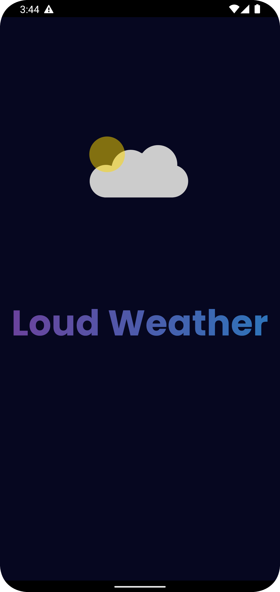
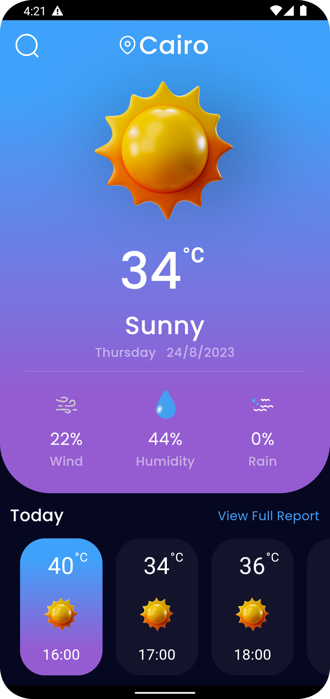
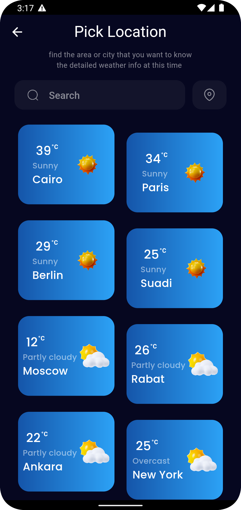
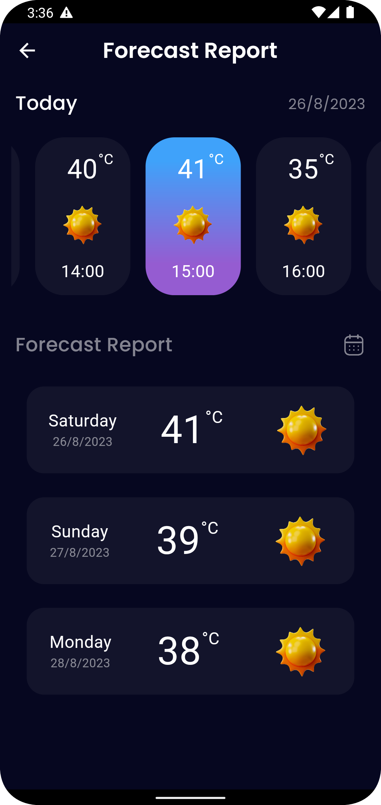

    <h1 align='center'><i>Loud Weather</i></h1>

<h2 href="#built-with">📝 Description : </h2>

Stay ahead of the weather with WeatherWise, the comprehensive and user-friendly app that provides you with accurate and up-to-date weather information right at your fingertips. Whether you're planning a trip, getting ready for outdoor activities, or simply want to stay informed about the conditions around you, WeatherWise has got you covered.

<h2 href="#built-with">🔑 Key Features : </h2>
Real-time Weather Updates: Get instant access to the current weather conditions in your location or any other city worldwide. Stay informed about temperature, humidity, wind speed, and direction, sunrise and sunset times, and more.

Hourly and Daily Forecasts: Plan your day effectively with detailed hourly and 7-day forecasts. Know what to expect in terms of temperature variations, precipitation chances, and weather patterns throughout the day, allowing you to make informed decisions about your activities.

Interactive Radar Maps: Visualize the weather patterns with interactive radar maps. Track storms, rain, snow, and other weather phenomena in real-time. Zoom in and out to see weather conditions at a local or global scale.

Severe Weather Alerts: Receive timely notifications and alerts about severe weather conditions such as thunderstorms, hurricanes, tornadoes, and more. Stay prepared and ensure your safety by staying informed of any potential risks.

Personalized Weather Data: Customize the app to suit your needs. Add and save multiple locations to monitor weather conditions in different places. Set preferred units for temperature, wind speed, and more.

Weather Widgets: Access weather information at a glance by adding customizable widgets to your device's home screen. Stay updated without even opening the app.

Sunrise and Sunset Times: Plan your day accordingly by knowing the precise times of sunrise and sunset. Ensure you never miss a beautiful sunrise or sunset moment.

Travel Planner: Going on a trip? WeatherWise allows you to plan ahead by providing weather forecasts for your destination. Make informed decisions about what to pack and activities to schedule.

Weather History: Dive into the past with historical weather data. Explore weather patterns and trends over time to gain insights into seasonal variations and climate change.

WeatherWise is your reliable companion for all your weather needs, combining accuracy, simplicity, and a beautiful interface. Download WeatherWise now and be prepared for whatever Mother Nature has in store for you.

<h2 style="display:inline">📝 Table of Contents</h2>

- [⛏️ Built With](#built-with)
- [🏁 Getting started](#getting-started)
- [📦 Packages used](#packages-used)
- [📷 Features](#features)
- [✍️ Contributors](#contributors)
- [🔒 License](#license)

<h2 href="#built-with">⛏️ Built With : </h2>
 <ul>
    <li><a href="https://dart.dev/">Dart</a></li>
    <li><a href="https://flutter.dev/">Flutter</a></li>
 </ul>

<h2 href="#packages-used">📦 Packages used : </h2>
 <ul>
  <li>shared_preferences</li>
  <li>dio</li>
  <li>curl_logger_dio_interceptor</li>
  <li>bloc</li>
  <li>flutter_bloc</li>
  <li>scrollable_positioned_list</li>
  <li>flutter_staggered_grid_view</li>
  <li>geolocator</li>
  <li>geocoding</li>
  <li>lottie</li>
  <li>google_fonts:</li>
  <li>flutter_launcher_icons:</li>
  <li>intl: </li>
 </ul>

## 📷 Features

<h3 style="display:inline">
<strong><em>⚡️Splash Screens & OnBoarding Screens</em></strong></h3>

   

<h3 style="display:inline">
<strong><em>🏠 Home</em></strong></h3>

   

 

<h3 style="display:inline">
<strong><em>🔍 Search </em></strong></h3>

   

 

<h3 style="display:inline">
<strong><em>📊 Details </em></strong></h3>

   

 

<h2 href="#Contributors">✅️ Reviewed by</h2>
<table>
<tr>
 
<td align="center">
 <b>Orange Digital Center</b></a> 
</td>

</tr>
</table>

## 🔒 License 

> This software is licensed under MIT License, See [License](https://github.com/CMP24-SWE-TEAM3/Backend/blob/main/LICENSE) .

